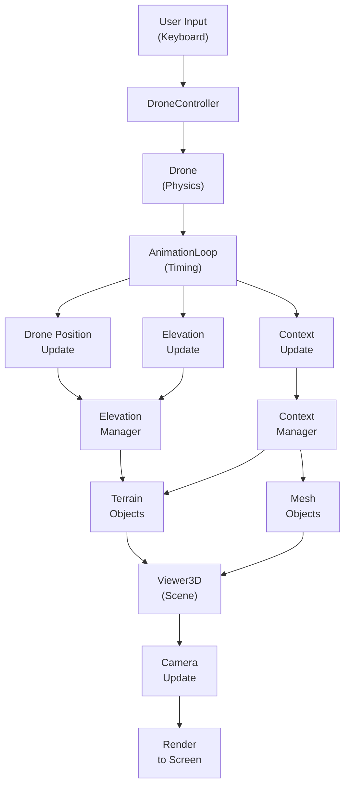

# Architecture

## Overview

A real-time 3D drone simulator that renders the drone's viewpoint as it moves through a virtual world. The system combines user input, physics simulation, real-world elevation data, and interactive 3D visualization to create an immersive flying experience.

## Main Components

### Input & Control
- **DroneController**: Captures keyboard input (arrow keys) and converts them into movement commands
- **Receives**: Raw keyboard events
- **Produces**: Movement instructions (forward/backward, left/right, rotate)

### Physics & Movement
- **Drone**: Simulates the drone as a moving object with position, heading, and altitude
- **Receives**: Movement commands from DroneController
- **Produces**: Updated location (coordinates) and orientation (direction facing)
- **Key trait**: Handles physics in geographic coordinates (Mercator projection), independent of 3D visualization

### Animation & Timing
- **AnimationLoop**: Orchestrates the frame-by-frame update cycle
- **Receives**: Browser's animation frame requests (60+ FPS)
- **Produces**: Regular update events with frame timing information

### Real-World Data Loading
- **ElevationDataManager**: Loads elevation (terrain height) data from real geographic sources
  - Fetches tiles in a ring around the drone's current location
  - Caches tiles to avoid redundant downloads
  - Manages tile lifecycle (load/unload) as drone moves
- **Receives**: Drone's location updates
- **Produces**: Elevation data for terrain mesh generation

- **ContextDataManager**: Placeholder for contextual data (e.g., landmarks, road networks)
- **Receives**: Drone's location updates
- **Produces**: Contextual information for visualization

### Terrain Visualization
- **TerrainObjectManager** (`src/visualization/terrain/TerrainObjectManager.ts`): Oversees the complete terrain rendering pipeline
  - Extends TileObjectManager; uses geometry as primary source, texture as secondary rebuild source
  - Coordinates mesh creation via TerrainObjectFactory
  - Creates/removes 3D mesh objects as needed
- **TerrainGeometryObjectManager** (`src/visualization/terrain/geometry/TerrainGeometryObjectManager.ts`): Converts raw elevation data into 3D mesh geometry
  - Listens to ElevationDataManager for tile events
  - Creates TileResource<BufferGeometry> objects
  - Emits tileAdded/tileRemoved events
- **TerrainTextureObjectManager** (`src/visualization/terrain/texture/TerrainTextureObjectManager.ts`): Renders textures (colors, patterns) on terrain
  - Listens to ContextDataManager for tile events
  - Creates TileResource<Texture> objects (null when context unavailable)
  - Emits tileAdded (non-null textures only) / tileRemoved events
- **TerrainCanvasRenderer** (`src/visualization/terrain/texture/TerrainCanvasRenderer.ts`): Renders contextual features to canvas
- **Receives**: Elevation data and context data
- **Produces**: 3D mesh objects ready for rendering

### Object Visualization
- **DroneObject**: Renders a 3D cone representing the drone in the world
- **MeshObjectManager**: Renders contextual objects (buildings, etc.) from context data
- **Receives**: Drone position/orientation and context data
- **Produces**: 3D objects positioned in the scene

### 3D Rendering
- **Viewer3D**: Wrapper around the 3D graphics engine (Three.js)
  - Manages the scene graph, camera, and rendering pipeline
  - Coordinates all visual elements (terrain, drone, objects)
- **Camera**: Positions the viewpoint behind and above the drone (chase camera)
  - Follows the drone's position
  - Looks toward the drone's heading
- **Receives**: All 3D objects (terrain meshes, drone, context objects)
- **Produces**: Final 2D image rendered to screen

### Orchestration
- **App.tsx**: The root component that initializes all systems and coordinates their interactions
- Sets up the complete system on app launch
- Ensures proper cleanup when app closes

## Interaction Flow

## Data Flow

### Each Frame

Data loading (elevation, context), mesh creation, and rendering happen via event subscriptions; see `src/App.tsx` for how drone movement cascades into tile loading and visual updates.

### As Drone Moves
- Drone moves through geographic coordinates (Mercator projection)
- ElevationDataManager detects when drone has left the current data ring
- New tiles are loaded in front, old tiles are unloaded behind
- Terrain geometry and textures are regenerated/updated
- 3D scene is seamlessly refreshed

## Key Conceptual Insights

### Separation of Concerns
- **Physics layer** (Drone) operates in geographic coordinates, unaware of 3D graphics
- **Visualization layer** (Viewer3D, Camera) translates geographic coordinates to 3D space
- **Data layer** (Managers) handles loading and caching independent of rendering

### Real-Time Responsiveness
- Animation loop drives all updates at 60+ FPS
- Physics updates happen before rendering so movement is smooth
- Camera follows drone position, keeping it centered on screen

### Scalable Data Management
- Tile-based loading allows simulation of unlimited terrain
- Ring-based tile management ensures only nearby terrain is loaded
- Caching prevents redundant downloads as drone flies

### World Representation
- The drone exists in real geographic coordinates (Mercator projection)
- Elevation data comes from real-world sources
- Camera and rendering translate this geographic world into a 3D visualization
- Users experience smooth flight through a real-world landscape

## State Management

The system maintains several types of state:

- **Drone state**: Position, heading, velocity (in geographic coordinates)
- **Scene state**: 3D objects in the scene (terrain meshes, drone representation, context objects)
- **Cache state**: Loaded elevation and context tiles in memory
- **UI state**: Camera position relative to drone

All state updates flow through the animation loop, ensuring consistent frame-to-frame synchronization.
