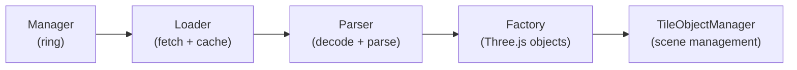
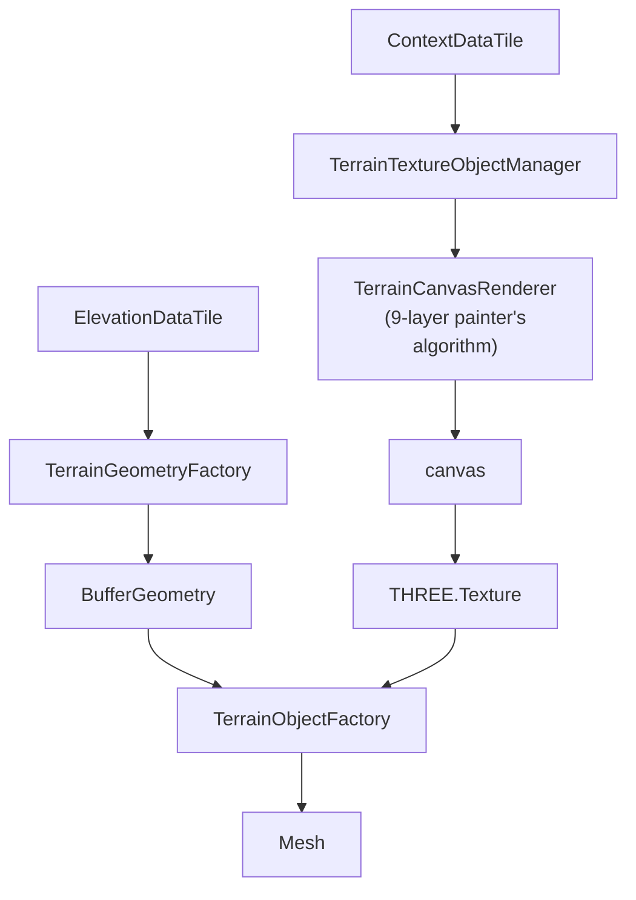
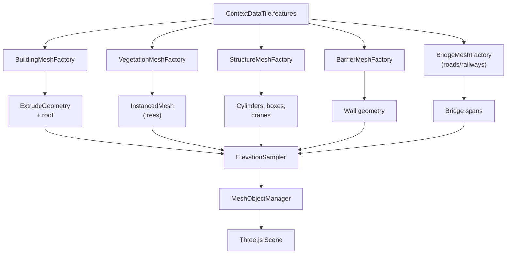
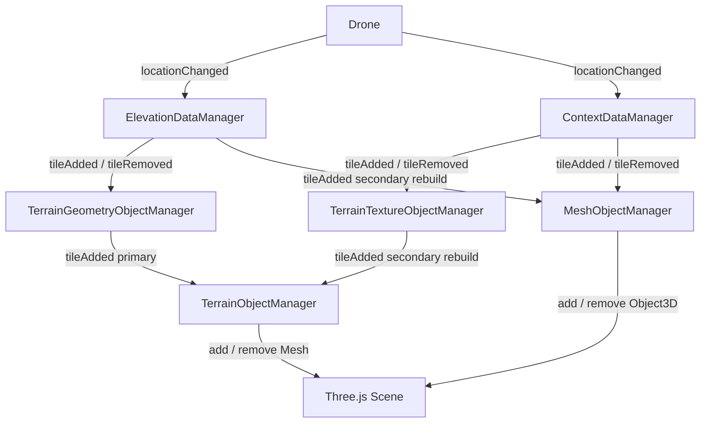
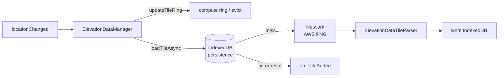

# Data Pipeline Pattern

## Overview

The drone simulator uses a consistent **five-stage pipeline pattern** for all tile-based data systems. Both pipelines — elevation and contextual — follow the same structure, enabling predictable lifecycle management, independent testability, and clean separation of concerns.

| Pipeline | Source | Output |
|----------|--------|--------|
| **Elevation** | AWS Terrarium PNG tiles | 3D terrain geometry |
| **Contextual** | Overture Maps (PMTiles) | Canvas texture + 3D objects |

**Why tiles?** Web Mercator z/x/y tiles allow constant-memory streaming: only the tiles around the drone are loaded, the rest are evicted. The ring radius determines how many tiles surround the center tile (radius 1 = 3×3 = 9 tiles).

---

## Pipeline Stages



Each stage communicates via typed events (`tileAdded` / `tileRemoved`) or direct method calls. No stage depends on implementation details of another.

---

## Stage 1 — Manager (ring orchestration)

**Files**: `src/data/shared/TileDataManager.ts`, `src/data/elevation/ElevationDataManager.ts`, `src/data/contextual/ContextDataManager.ts`

`TileDataManager<TileType>` is an abstract base class that owns all ring management logic. Subclasses implement only how a single tile is fetched.

**Responsibilities:**
- Subscribes to `drone.locationChanged` at construction
- On each location update, computes the new tile center and calls `updateTileRing()`
- `updateTileRing()` diffs the desired tile set against the current cache:
  - **New tiles**: calls `loadTileAsync(key)` for each missing tile
  - **Evicted tiles**: removes from `tileCache`, cancels from `pendingLoads`, emits `tileRemoved`
- Concurrency control: `loadingCount` + `maxConcurrentLoads` limit simultaneous network requests (default: **3**); `processQueuedTiles()` drains the queue as slots free
- Emits `tileAdded` / `tileRemoved` via `TypedEventEmitter`
- `dispose()`: aborts pending requests via `AbortController`, clears all maps, unsubscribes from drone

**Tile key format**: `"z:x:y"` (e.g., `"15:16832:11432"`)

**ContextDataManager specifics**: ContextDataManager uses PMTiles archives (no rate limits). It maintains a pending queue with timeout to handle slow responses and concurrency control.

**Configuration** (in `src/config.ts`):
```typescript
{
  zoomLevel: 15,           // Web Mercator zoom level
  ringRadius: 1,           // 1 → 3×3 = 9 tiles around drone
  maxConcurrentLoads: 3,   // simultaneous network requests
}
```

---

## Stage 2 — Loader (fetch + 3-layer cache)

**Files**: `src/data/elevation/ElevationDataTileLoader.ts`, `src/data/contextual/ContextDataTileLoader.ts`, `src/data/shared/tileLoaderUtils.ts`

The Loader is responsible for fetching a single tile, with caching and retry logic. It is invoked by the Manager's `loadTileAsync()` implementation.

**3-layer cache (checked in order):**

1. **In-memory `tileCache` Map** — session-scoped, fastest; checked by the Manager before the Loader is called
2. **IndexedDB persistence cache** — survives page reloads; checked by `loadWithPersistenceCache()` via `ElevationTilePersistenceCache` / `ContextTilePersistenceCache`
3. **Network fetch** — AWS Terrarium PNG (elevation) or Overture PMTiles MVT (contextual)

`tileLoaderUtils.ts` provides the `loadWithPersistenceCache()` helper that orchestrates the IndexedDB check + network fallback + write-back pattern. Cache errors are silently swallowed — the cache is an optional optimization, not a critical path.

**Retry logic**: Up to **3 attempts** with exponential backoff (`100ms × 2^attempt`).

**Abort propagation**: Each Loader call accepts an `AbortSignal` from the Manager's `AbortController`, so in-flight requests cancel cleanly when a tile leaves the ring.

---

## Stage 3 — Parser (data decoding)

**Files**: `src/data/elevation/ElevationDataTileParser.ts`, `src/data/contextual/pmtiles/OvertureParser.ts`, `src/features/*/overtureClassify.ts`

Parsers convert raw network bytes into structured data types. They have no Three.js dependencies and are fully testable in isolation.

### Elevation parser

`ElevationDataTileParser` decodes AWS Terrarium PNG tiles:

```
PNG (256×256 RGBA pixels)
     ↓
Read R, G, B channels per pixel
     ↓
elevation = (R × 256 + G + B/256) - 32768  (meters)
     ↓
number[][] grid [row][column], 256×256
```

Output type: `ElevationDataTile` — includes the grid, tile coordinates, zoom level, and Mercator bounds.

### Contextual parser

`OvertureParser` parses decoded MVT layers from Overture Maps PMTiles into a structured feature map. It routes each MVT layer to the appropriate classifier function by layer name (8 layer handlers):

| MVT Layer | Classifier | Feature type |
|-----------|-----------|-------------|
| `building` | `classifyOvertureBuilding` | Buildings (footprints, heights, roof shapes) |
| `building_part` | `classifyOvertureBuilding` | Building parts |
| `segment` | `classifyOvertureRoad` / `classifyOvertureRailway` | Roads, railways |
| `land_use` | `classifyOvertureLanduse` | Land use areas |
| `land` | `classifyOvertureLanduse` / `classifyOvertureVegetation` | Land features |
| `land_cover` | `classifyOvertureVegetation` | Vegetation cover |
| `infrastructure` | `classifyOvertureAeroway` | Aeroways |
| `water` | `classifyOvertureWater` | Water bodies and waterways |

Output type: `ContextDataTile` — includes `features` grouped by category, tile coordinates, Mercator bounds, and color palette.

**Note**: `TerrainCanvasRenderer` is **not** a parser. It is a texture generator (Stage 4) that consumes an already-parsed `ContextDataTile`.

---

## Stage 4 — Factory (Three.js object creation)

**Files**: `src/visualization/terrain/`, `src/visualization/mesh/`

Factories convert parsed data into Three.js objects. Each factory is pure: given the same input, it produces the same geometry.

### Terrain pipeline (elevation + context)



### 3D object pipeline (context only)



All factories position objects using the same coordinate convention via `geoToLocal()`:
```
X = (lng - origin.lng) × cos(lat) × EARTH_RADIUS × π/180   // east
Y = elevation                                                // up
Z = -(lat - origin.lat) × EARTH_RADIUS × π/180             // south
```
Where `origin` is the drone's current lat/lng (the Three.js world origin).

---

## Stage 5 — TileObjectManager (scene management)

**File**: `src/visualization/TileObjectManager.ts`

`TileObjectManager<TInput, TOutput>` is an abstract base class that manages the lifecycle of typed Three.js objects in response to tile events from a data source.

**Core pattern:**
- Subscribes to a **primary** data source (`tileAdded` / `tileRemoved`)
- On `tileAdded`: calls `createObject(key, tile)`, stores result, calls `onObjectAdded` hook
- On `tileRemoved`: calls `disposeObject(obj)`, removes from maps, calls `onObjectRemoved` hook
- Optional **secondary sources**: when they emit `tileAdded` for an **already-present** key, the existing object is disposed and recreated with the stored input — a **rebuild**. This allows late-arriving data to update existing objects without manual orchestration.

**Rebuild use cases:**
- `TerrainObjectManager`: geometry arrives first (primary), texture arrives later (secondary) → mesh rebuilt with texture applied
- `MeshObjectManager`: context tile arrives first (primary), elevation tile arrives later (secondary) → meshes rebuilt at correct ground elevation

**Concrete subclasses:**

| Class | Primary | Secondary | Output |
|-------|---------|-----------|--------|
| `TerrainGeometryObjectManager` | `ElevationDataManager` | — | `TileResource<BufferGeometry>` + emits geometry events |
| `TerrainTextureObjectManager` | `ContextDataManager` | — | `TileResource<THREE.Texture> \| null` + emits texture events |
| `TerrainObjectManager` | `TerrainGeometryObjectManager` | `TerrainTextureObjectManager` | `TileResource<Mesh>` in scene |
| `MeshObjectManager` | `ContextDataManager` | `ElevationDataManager` | `Object3D[]` in scene |

`TerrainTextureObjectManager` stores `null` for tiles where context data failed — this prevents null textures from triggering a rebuild in `TerrainObjectManager`, enabling graceful degradation to a flat-color material.

---

## Global Coordination Diagrams

### Object wiring



### Data loading path (elevation; contextual is symmetric)



---

## System-Specific Summary

| | Elevation | Contextual (texture) | Contextual (objects) |
|--|-----------|---------------------|----------------------|
| **Source** | AWS Terrarium PNG | Overture Maps PMTiles | Overture Maps PMTiles |
| **Manager** | `ElevationDataManager` | `ContextDataManager` | `ContextDataManager` |
| **Loader** | `ElevationDataTileLoader` | `ContextDataTileLoader` | `ContextDataTileLoader` |
| **Parser** | `ElevationDataTileParser` | `OvertureParser` (7 classifiers) | `OvertureParser` (7 classifiers) |
| **Factory** | `TerrainGeometryFactory` → `TerrainObjectFactory` | `TerrainTextureFactory` → `TerrainCanvasRenderer` | `BuildingMeshFactory`, `VegetationMeshFactory`, etc. |
| **TileObjectManager** | `TerrainGeometryObjectManager` → `TerrainObjectManager` | `TerrainTextureObjectManager` → `TerrainObjectManager` | `MeshObjectManager` |
| **Scene output** | Terrain mesh | Texture on terrain mesh | Buildings, trees, structures |

---

## Graceful Degradation

| Failure | Behavior |
|---------|----------|
| Elevation tile fails (all retries) | `null` propagated; no crash; terrain mesh not created for that tile |
| Context tile fails | `null` stored in `TerrainTextureObjectManager`; mesh rendered with flat color |
| Null texture | Does **not** emit `tileAdded` from `TerrainTextureObjectManager`; no rebuild triggered |
| PMTiles network failure | Exponential backoff retry (3 attempts); tile skipped on final failure |
| IndexedDB unavailable | Warning logged; falls through to network fetch |

---

## Related Documentation

- **Elevation data details**: [`data/elevations.md`](data/elevations.md)
- **Contextual data details**: [`data/contextual.md`](data/contextual.md)
- **Canvas rendering**: [`visualization/canvas-rendering.md`](visualization/canvas-rendering.md)
- **Ground surface (terrain mesh)**: [`visualization/ground-surface.md`](visualization/ground-surface.md)
- **3D objects**: [`visualization/objects/README.md`](visualization/objects/README.md)
- **Coordinate system**: [`coordinate-system.md`](coordinate-system.md) — geographic → Three.js local tangent plane math
- **Tile ring system**: [`tile-ring-system.md`](tile-ring-system.md) — ring loading details
- **Glossary**: [`glossary.md`](glossary.md)
