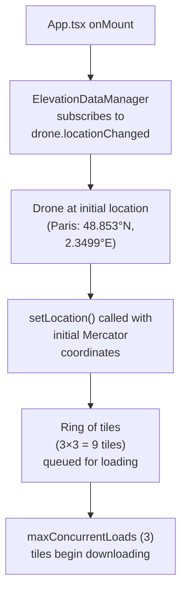
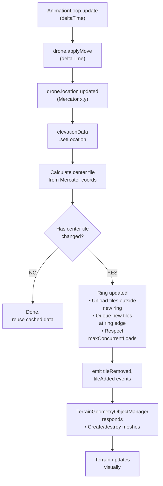
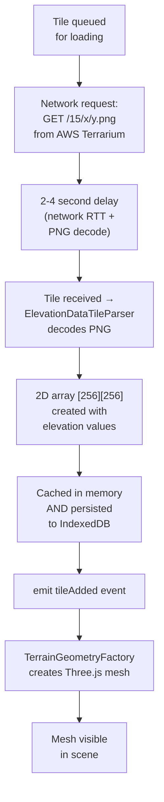
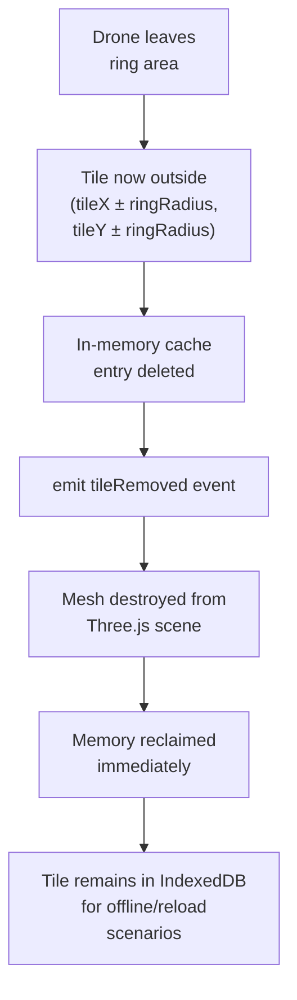
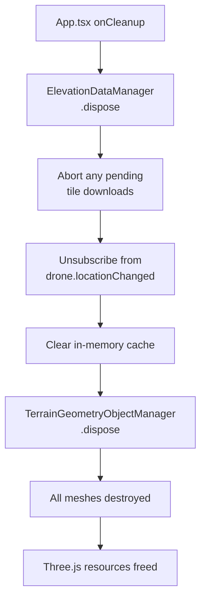
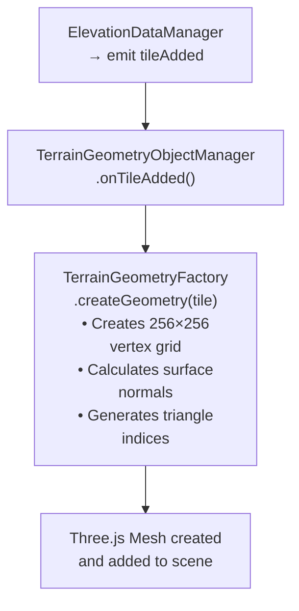
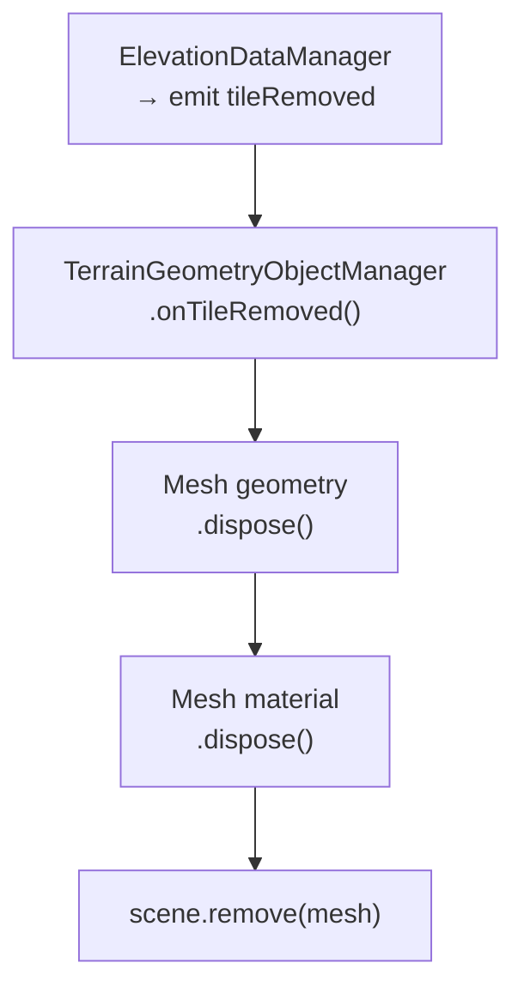
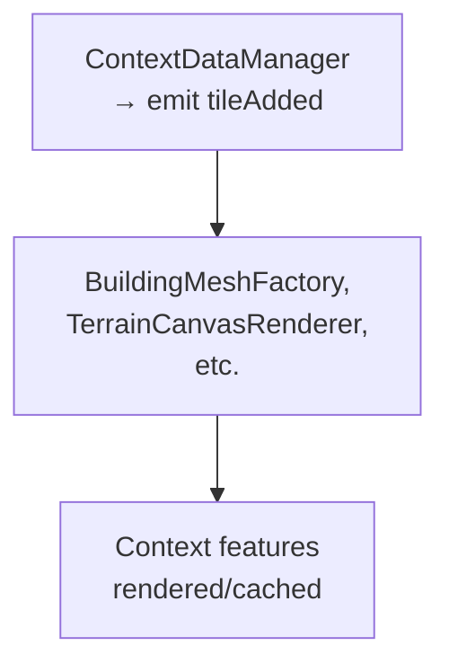

# Tile Ring System

## Overview

The tile ring system is the core spatial loading mechanism for the drone simulator. Instead of loading all tiles globally, the system maintains a **dynamic ring of tiles** around the drone's current position, loading new tiles as the drone approaches the ring edge and unloading tiles as it moves away.

### Why Ring-Based Loading?

**Network efficiency** - Only tiles near the drone are fetched, not the entire planet
**Memory efficiency** - Old tiles are evicted automatically; memory usage stays constant
**Performance** - Predictable loading pattern allows smooth gameplay without stutters
**Configurability** - Ring size easily adjusts via `ringRadius` parameter to balance quality vs. performance

---

## Mathematical Definition

### Ring Formula

A ring with radius **r** contains:

```
Tiles per side = 2r + 1
Total tiles = (2r + 1)²
```

**Examples:**
- Radius 1: (2×1 + 1)² = 3² = **9 tiles** (3×3 grid)
- Radius 2: (2×2 + 1)² = 5² = **25 tiles** (5×5 grid)
- Radius 3: (2×3 + 1)² = 7² = **49 tiles** (7×7 grid)

### Center Tile Computation

The drone's current Mercator location determines the center tile:

```
1. Get drone's Mercator coordinates (x, y)
2. Divide by tile size at zoom level to get (tileX, tileY)
3. Load tiles from (tileX - r) to (tileX + r) in both X and Y directions
```

### Tile Key Format

Each tile is uniquely identified by a **z:x:y** key:

```
z = zoom level      (fixed at 15 for elevation, configurable for other data)
x = column index    (0-32767 at zoom 15; 0 = westernmost, increases eastward)
y = row index       (0-32767 at zoom 15; 0 = northernmost, increases southward)

Example: "15:16384:10741" = Zoom 15, column 16384, row 10741
```

---

## Configuration

### Elevation Data Configuration

**File:** `src/config.ts` (lines 70-82)

```typescript
export const elevationConfig = {
  // Web Mercator zoom level for terrain tiles
  zoomLevel: 15,

  // Number of tiles in each direction from center
  // 1 = 3×3 grid (9 tiles)
  // 2 = 5×5 grid (25 tiles)
  ringRadius: 1,

  // Maximum concurrent tile downloads
  // Prevents network saturation
  maxConcurrentLoads: 3,

  // AWS Terrarium elevation service endpoint
  elevationEndpoint: 'https://s3.amazonaws.com/elevation-tiles-prod/terrarium',
};
```

### Context Data Configuration

**File:** `src/config.ts` (lines 84-99)

```typescript
export const contextDataConfig = {
  // Web Mercator zoom level for context tiles
  zoomLevel: 15,

  // Number of tiles in each direction from center
  ringRadius: 1,

  // Maximum concurrent PMTiles requests
  maxConcurrentLoads: 6,

  // Query timeout in milliseconds
  queryTimeout: 30000,

  // Overture Maps PMTiles configuration
  overtureVersion: '2026-02-18.0',
  overtureBaseUrl: 'https://tiles.overturemaps.org',
  overtureThemes: ['buildings', 'transportation', 'base'],
};
```

### Performance Tuning

| Setting | Default | Impact | Notes |
|---------|---------|--------|-------|
| **ringRadius** | 1 | 9 tiles per ring | Increase for more context; affects memory and network load |
| **zoomLevel** | 15 | ~4.77 m/pixel | Higher = finer detail but more tiles; lower = coarser tiles |
| **maxConcurrentLoads** | 3 | Network I/O | Browsers allow ~6 concurrent connections; 3 leaves headroom |

**Typical tuning:**
- **High-end hardware:** ringRadius 2, zoomLevel 15 (25 tiles per ring)
- **Low-end hardware:** ringRadius 1, zoomLevel 14 (9 tiles, coarser detail)
- **Mobile devices:** ringRadius 1, zoomLevel 14, maxConcurrentLoads 2

---

## Ring Lifecycle

### 1. Initial Load (App Startup)



**Result:** Initial tiles visible after ~2-3 seconds (network dependent)

### 2. Per-Frame Update (Animation Loop)



**Key property:** Ring updates only when drone crosses tile boundary, not every frame

### 3. Tile Loading (Network Phase)



**Concurrency:** While one tile loads, up to 2 others can load simultaneously (maxConcurrentLoads = 3)

### 4. Tile Eviction (Memory Management)



**Result:** Memory usage stays constant; ring of ~9 tiles ≈ 2.3 MB

### 5. Cleanup (App Shutdown)



---

## Event Flow

### tileAdded Event

```typescript
tileAdded: {
  key: "15:16384:10741",                    // z:x:y tile key
  tile: ElevationDataTile                   // Elevation grid [256][256]
}
```

**Triggered when:** Tile finishes loading from network or IndexedDB cache
**Listener:** TerrainGeometryObjectManager creates mesh
**Frequency:** Once per tile per session (unless cleared from memory and reloaded)

### tileRemoved Event

```typescript
tileRemoved: {
  key: "15:16384:10741"                     // z:x:y tile key
}
```

**Triggered when:** Drone leaves tile's ring area
**Listener:** TerrainGeometryObjectManager destroys mesh
**Frequency:** When drone crosses ring boundary and tile exits ring

---

## Caching Strategy

### Two-Layer Cache

**Layer 1: In-Memory (RAM)**
- Fastest access during gameplay
- Automatically evicted when tile leaves ring
- Size: ~256 KB per tile × 9 tiles = ~2.3 MB for 3×3 ring

**Layer 2: Persistent (IndexedDB)**
- Survives page reload
- 24-hour TTL prevents stale data
- Enables offline playback for previously visited areas
- Browser storage quota typically 50+ MB
- No size limit enforcement at application level

### Cache Key Format

```typescript
// In-memory cache
elevationDataManager.cache[`${z}:${x}:${y}`] = ElevationDataTile

// IndexedDB persistent storage
db.store('elevation').put({
  key: `${z}:${x}:${y}`,
  data: number[][],       // The 256×256 elevation grid
  storedAt: timestamp,
  expiresAt: timestamp    // Now + 24 hours
})
```

### TTL Strategy

**24-hour expiration** balances:
- **Too short:** Excessive network requests, lower cache hit rate
- **Too long:** Stale elevation data if terrain changes (landslides, construction)

Both elevation and context data systems use **24 hours** for consistency.

---

## Spatial Organization

### Web Mercator Coordinates

All tile systems use **Web Mercator (EPSG:3857)** projection:

```
Axes:
  X increases eastward (positive direction = toward 180°)
  Y increases northward (positive direction = toward North Pole)

Zoom 15 bounds:
  X: 0 to 2^15 - 1 = 0 to 32,767
  Y: 0 to 2^15 - 1 = 0 to 32,767
```

**Key property:** Mercator Y increases northward, but Three.js Z must be **negated** for proper camera orientation. See `doc/coordinate-system.md` for full explanation.

### GPS to Tile Conversion

```
Given: GPS coordinates (latitude, longitude)

Step 1: Convert to Web Mercator meters
  latitude → Mercator Y using standard projection formula
  longitude → Mercator X

Step 2: Find tile containing the point
  Divide Mercator meters by tile size at zoom level
  Result: integer (tileX, tileY)

Step 3: Load ring around center tile
  Load tiles (tileX ± ringRadius, tileY ± ringRadius)

Example: Paris (48.853°N, 2.3499°E) at zoom 15
  ↓
  Mercator: (261,700m, 6,250,000m)
  ↓
  Tile: z=15, x=16,384, y=10,741
  ↓
  Ring: (16383-16385, 10740-10742) = 9 tiles
```

### Understanding Zoom Levels

```
Zoom 15 at equator:
  Global extent: ~40,075 km (Earth circumference in Web Mercator)
  Tiles per dimension: 2^15 = 32,768
  Per-tile size: 40,075 km ÷ 32,768 ≈ 1.22 km
  Per-pixel size: 1.22 km ÷ 256 pixels ≈ 4.77 m/pixel

Zoom level formula:
  Per-tile width (km) = 40,075 / 2^z
  Per-pixel width (m) = (40,075 / 2^z) / 256 × 1000

Higher zoom = More tiles, finer detail, more memory/network
Lower zoom = Fewer tiles, coarser detail, faster loading
```

---

## Integration Points

### Animation Loop Timing

The ring system updates when the drone moves. AnimationLoop calls `drone.applyMove(deltaTime)`, which emits `locationChanged`. This triggers `ElevationDataManager.setLocation()` and `ContextDataManager.setLocation()`, which update their tile rings. Ring updates complete before mesh creation so meshes have fresh data.

### Tile Consumer: TerrainGeometryObjectManager

When `tileAdded` event fires:



When `tileRemoved` event fires:



### Tile Consumer: ContextDataManager (Similar Pattern)

Context data (roads, buildings, vegetation) uses the same ring pattern:



---

## See Also

- **[Glossary](../glossary.md)** - Definitions of all technical terms
- **[Coordinate System](coordinate-system.md)** - Z-negation and Mercator details
