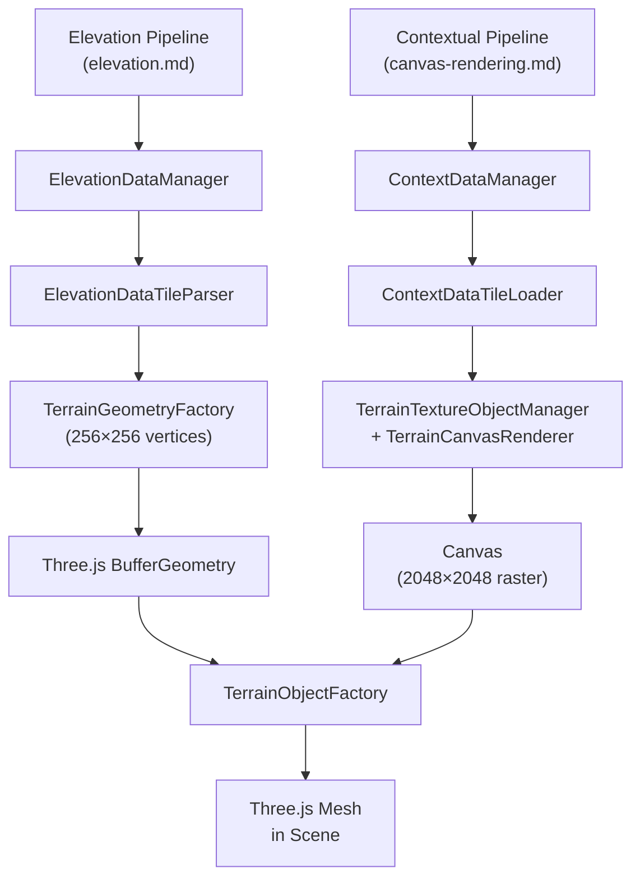
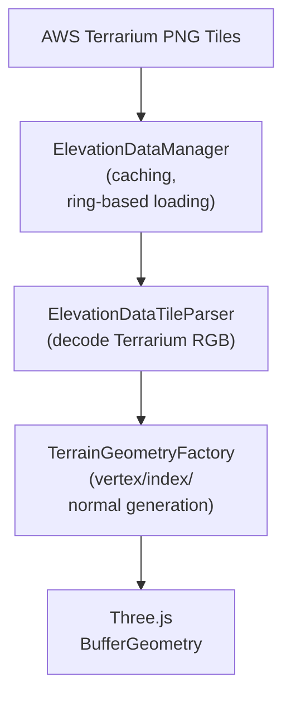
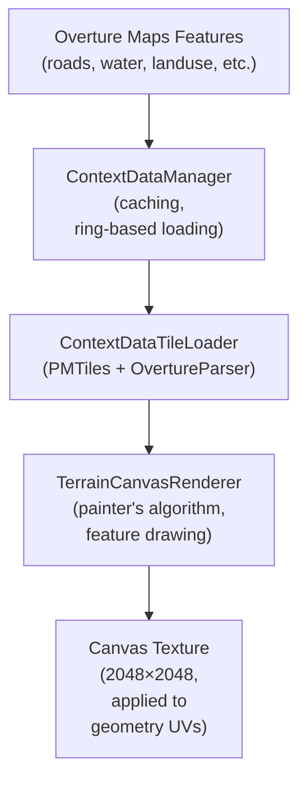
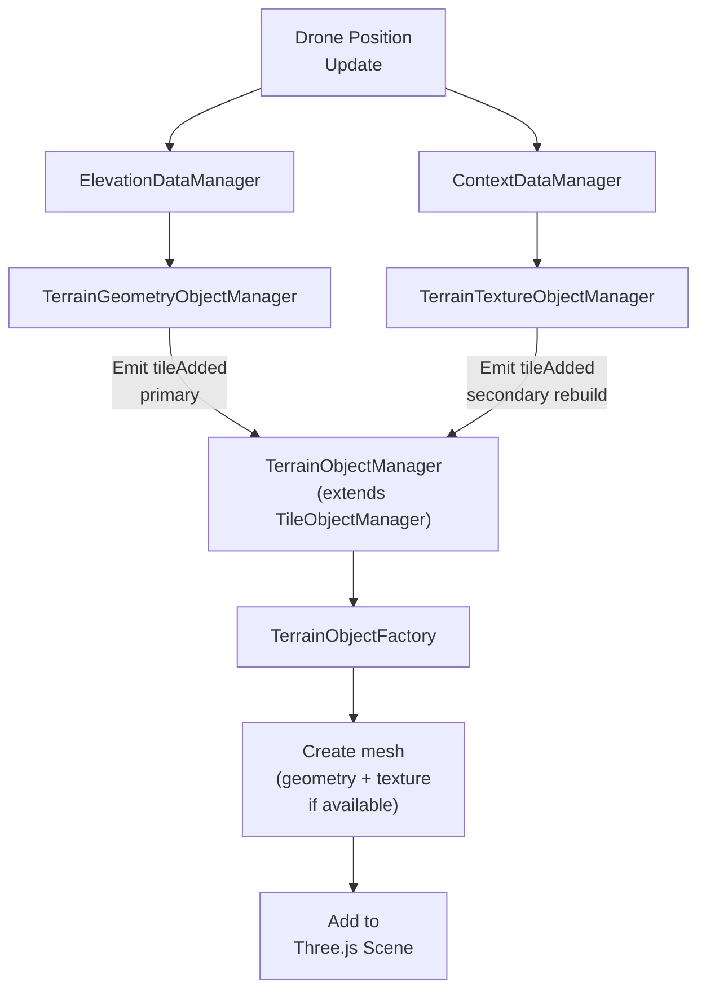

# Ground Surface Rendering

## Overview

The ground surface rendering system displays realistic terrain by combining two data sources:

1. **Elevation data** → Three.js mesh geometry (3D shape)
2. **Overture Maps features** → Canvas texture (visual detail)

This two-stage asynchronous pipeline ensures responsive rendering: elevation geometry loads first (basic terrain shape), then texture details appear as canvas rendering completes. Both pipelines work independently and converge in the 3D scene.

Both the elevation and contextual data systems follow the standard **Data Pipeline Pattern**
(see [`doc/data-pipeline.md`](../data-pipeline.md) for detailed explanation).

### Integrated Rendering Pipeline

The terrain rendering system orchestrates two parallel pipelines:



For the general pipeline stages (Manager → Parser → Factory) and how they apply
across the system, see the Data Pipeline Pattern documentation.

### Key Properties

| Property | Value | Purpose |
|----------|-------|---------|
| **Zoom Level** | 15 (Web Mercator) | Tile resolution (tighter zoom = more detail tiles) |
| **Tile Size** | 256×256 pixels | Elevation grid dimension |
| **Canvas Size** | 2048×2048 pixels | Feature texture detail (see `TerrainTextureFactory.ts: createTexture() method`) |
| **Ring Radius** | 1-3 (configurable) | Tile loading radius around drone (1=3×3 grid) |
| **Max Concurrent Loads** | 3 | Network concurrency limit |
| **Elevation Range** | -430 m to ~9000 m | Dead Sea to Everest |
| **Elevation Precision** | ±0.1m (sub-meter) | Terrarium RGB format accuracy |

### Texture Configuration

The canvas size parameter is defined in `src/config.ts` (lines 465-469):

```typescript
export const textureConfig = {
  // Ground canvas size in pixels for rendering contextual features (roads, water, landuse, etc.)
  // Higher values provide more detail but increase canvas rendering time
  groundCanvasSize: 2048,
};
```

This configuration is used by:
- **`TerrainTextureFactory.ts: createTexture() method`** — Creates offscreen canvas with dimensions `groundCanvasSize × groundCanvasSize` for rendering contextual features (lines 46-48)

The **2048×2048 pixel canvas** provides sufficient detail for feature rendering at zoom level 15 while keeping canvas rendering time reasonable. Higher values (e.g., 4096) would provide finer texture detail but increase CPU rendering time; lower values (e.g., 1024) would reduce rendering time but lose detail.

---

## Core Architecture

The four tile-event-driven managers (`TerrainGeometryObjectManager`, `TerrainTextureObjectManager`, `TerrainObjectManager`, `MeshObjectManager`) all extend the shared abstract base `TileObjectManager`, which handles event subscription, object storage, and disposal lifecycle. Each manager only implements `createObject` and `disposeObject` for its specific output type.

The terrain rendering system consists of three main components working in concert:

### 1. Elevation Pipeline

Converts elevation data tiles into Three.js geometry. See Stage 1 (Manager) and Stage 3 (Factory) in [`doc/data-pipeline.md`](../data-pipeline.md).



### 2. Texture Pipeline

Renders contextual features onto a canvas texture. See Stage 1 (Manager), Stage 2 (Parser), and Stage 3 (Factory) in [`doc/data-pipeline.md`](../data-pipeline.md).



### 3. Mesh Integration

Orchestrates both pipelines and creates final 3D meshes. This pattern matches Stage 4 (Visualization) in [`doc/data-pipeline.md`](../data-pipeline.md).



**Coordination Logic**:
- **TerrainObjectManager** extends `TileObjectManager` (inheritance, not manual subscription)
- Geometry is the **primary source**: mesh is created as soon as geometry arrives
- Texture is a **secondary rebuild trigger**: if texture arrives after geometry, mesh is rebuilt with it applied
- Null textures (context unavailable) do not trigger rebuilds — graceful degradation to flat color
- Meshes are removed when geometry unloads

---

## Elevation Data to Geometry

### Source Data

Elevation tiles come from **ElevationDataManager**, which fetches 256×256 pixel PNG images from AWS Terrarium service at Web Mercator zoom level 15. Each pixel encodes elevation using the **Terrarium RGB formula**:

```
Elevation (meters) = (R × 256 + G + B/256) - 32768
```

Example values:
- RGB(128, 0, 0) = 0 m (sea level)
- RGB(129, 0, 0) = 256 m
- RGB(162, 144, 0) ≈ 8848 m (Mount Everest)
- RGB(127, 255, 255) ≈ -430 m (Dead Sea)

See `doc/data/elevations.md` for detailed elevation specifications.

### Vertex Generation

**TerrainGeometryFactory** converts elevation data into Three.js mesh geometry:

1. **Grid sampling**: 256×256 elevation values → 256×256 vertices
2. **Coordinate mapping**:
   ```
   X = (column / 256 - 0.5) × tileWidthMeters   // east from tile center
   Y = elevation[row][column]                     // up
   Z = (row / 256 - 0.5) × tileHeightMeters      // south from tile center
   ```

3. **Index generation**: 255×255 grid of square cells = 2 triangles per cell = 390,150 indices

### Attributes

Each vertex includes:

| Attribute | Type | Purpose |
|-----------|------|---------|
| **Position** | Vec3 (x, y, z) | 3D location in local tile space (east/up/south from tile center) |
| **Normal** | Vec3 | Face normal for lighting (computed via `computeVertexNormals()`) |
| **UV** | Vec2 (u, v) | Texture coordinates for canvas overlay |

### Normals & Lighting

Normals are **computed automatically** from the triangle mesh using Three.js's `computeVertexNormals()`. This calculates per-vertex normals by averaging face normals of adjacent triangles. Proper normals are critical for realistic **Phong lighting** (the material used for ground meshes).

---

## Texture Rendering (Contextual Features)

### Purpose

While elevation geometry provides the 3D shape, contextual feature textures add visual detail: roads, water bodies, landuse areas, vegetation, railways, etc. Instead of drawing these as individual meshes (which would create millions of geometry objects), they're **rasterized to a 2048×2048 canvas texture** for efficient rendering.

**See [`doc/visualization/canvas-rendering.md`](./canvas-rendering.md) for comprehensive documentation of:**
- Canvas rendering pipeline and architecture
- 9-layer painter's algorithm drawing order
- Coordinate transformation mathematics
- Feature types, colors, and canvas drawing settings
- Edge cases (polygon holes, tile boundaries, seamless alignment)
- Integration with TerrainTextureFactory and terrain meshes

### Quick Reference

**Drawing order (back-to-front):**
1. Ground fill → 2. Landuse → 3. Water bodies → 4. Wetlands → 5. Waterway lines → 6. Vegetation → 7. Aeroways → 8. Roads (sorted by width) → 9. Railways

**Key file:** `src/visualization/terrain/texture/TerrainCanvasRenderer.ts` — Main rendering engine with 9 layer methods

---

## Spatial Organization

### Web Mercator Projection

Ground surface tiles are organized using the **Web Mercator projection** at zoom level 15:

- **Tile key**: `z:x:y` (zoom:column:row)
  - z = 15 (fixed)
  - x, y derived from drone's Mercator coordinates
  - Each tile covers ~1.22 km × ~1.22 km at equator (rounded to ~2 km for readability; varies by latitude)

- **Tile size**: 256×256 pixels
  - Maps to (tileWidthMeters × tileHeightMeters) in real-world coordinates
  - Exact meters depend on latitude

See `doc/coordinate-system.md` for projection details.

### Ring-Based Loading

Tiles are loaded in concentric rings around the drone's current position. As the drone moves:
1. **Drone approaches ring edge** → New tiles queue for loading
2. **Tile finishes loading** → `tileAdded` event triggers mesh creation
3. **Drone leaves ring** → `tileRemoved` event triggers mesh cleanup

This ensures **seamless terrain** without gaps or memory bloat.

**Configuration**: `src/config.ts` → `elevationConfig.ringRadius` (default: 1)

For ring patterns, tile fetch sequencing, lifecycle phases, and coordinate details, see [`doc/tile-ring-system.md`](../tile-ring-system.md).

### Mesh Positioning

Each loaded tile is positioned at its **tile center** relative to the drone's current position (the Three.js origin):

```typescript
const pos = geoToLocal(centerLat, centerLng, 0, origin);
mesh.position.set(pos.x, pos.y, pos.z);
```

Where `origin` = `originManager.getOrigin()` (drone's current lat/lng). Z-negation is internal to `geoToLocal()`, not done manually.

---

## Coordinate System & Local Tangent Plane

Terrain meshes are positioned using `geoToLocal()`, which converts geographic coordinates to Three.js local space relative to the drone's position (the origin):

```
X = (lng - origin.lng) × cos(lat) × EARTH_RADIUS × π/180   // east
Y = elevation                                                // up
Z = -(lat - origin.lat) × EARTH_RADIUS × π/180             // south
```

The drone is always at `(0, elevation, 0)`. All terrain tile centers are expressed as offsets from the drone in meters.

For complete explanation and rationale, see [Coordinate System & Rendering Strategy](../coordinate-system.md).

All ground surface code uses this formula consistently. Implementation details:
- `TerrainObjectFactory.ts: createTerrainObject() method` — mesh center positioning via `geoToLocal(centerLat, centerLng, 0, origin)` (line ~51)
- `TerrainGeometryFactory.ts` — vertex positions in local tile space
- `TerrainCanvasRenderer.ts` — texture UV mapping

---

## Integration with Drone System

### Lifecycle

Ground surface rendering is driven by tile events from `ElevationDataManager` and `ContextDataManager`; meshes are created/removed via `TerrainObjectManager` as tiles load/unload.

Terrain tiles are added/removed as the drone moves (steps 2-4 handle elevation loading, mesh creation, and removal). The system maintains a configurable ring of tiles around the drone and evicts tiles outside the ring.

### Elevation Sampling

Other 3D objects (buildings, trees, vegetation) can **sample the terrain elevation** to position themselves realistically on the ground. The elevation system provides `getTileAt(location)` and elevation sampling methods for this purpose. See `doc/data/elevations.md`.

### Graceful Degradation

The system degrades gracefully if data is unavailable:

- **Elevation data unavailable**: Geometry rendered with default elevation or wireframe
- **Texture unavailable**: Mesh renders with solid ground color (#d8c8a8) until texture loads
- **Both unavailable**: Wireframe mesh visible (debug fallback)

---

## Performance & Optimization

### Why Canvas Textures

Contextual features include millions of line segments (roads, railways, waterways). Rendering each as individual Three.js geometry would create millions of mesh objects, causing:
- Excessive draw calls
- Memory overhead (vertices + indices per feature)
- GPU bottleneck

Rasterizing to a **2048×2048 canvas** solves this:
- Single texture per tile (minimal memory)
- Single mesh per tile (single draw call)
- CPU rendering of vector data is fast enough for offline canvas

### Tile Caching

Loaded tiles are cached in memory to avoid re-fetching and re-parsing:

| Cache Layer | Type | Scope |
|------------|------|-------|
| **In-memory** | `Map<z:x:y, Tile>` | Active tiles + recent history |
| **IndexedDB** (optional) | Persistent browser storage | Survive page reloads |

Tiles outside the ring are **evicted** automatically to prevent unbounded memory growth.

### Concurrency Limits

To avoid network saturation:
- Maximum **3 concurrent elevation tile loads**
- Excess tiles queued and processed as loads complete
- Similar limit for texture tiles

This prevents hundreds of simultaneous HTTP requests.

### Level-of-Detail (LOD)

Currently, a **single mesh per tile** is rendered regardless of distance. No LOD variants. Future optimization could:
- Simplify distant tile geometry (fewer vertices)
- Use lower-resolution textures for distant tiles

For now, all tiles use full 256×256 vertex resolution.

---

## Material & Rendering

### MeshPhongMaterial

Ground meshes use Three.js **MeshPhongMaterial**:

```javascript
new THREE.MeshPhongMaterial({
  map: canvasTexture,      // Feature texture
  shininess: 10,           // Low shininess (matte terrain)
  side: THREE.FrontSide,   // Only front faces visible
})
```

This material:
- Applies **canvas texture** to mesh UVs
- Supports **Phong reflection** (combines ambient + diffuse + specular lighting)
- Works with Three.js lights and shadows

### Texture Filtering

Three.js applies **mipmapping** for texture filtering:
- **Close**: `NearestFilter` (sharp pixels visible)
- **Distance**: `LinearMipmapLinearFilter` (blurred, prevents flickering)

This ensures terrain looks crisp when close and smooth when far.

### Wireframe Mode (Debug)

For development, meshes can render as **wireframe** (triangle edges visible):

```javascript
material.wireframe = true;
```

Useful for:
- Visualizing vertex grid (256×256)
- Debugging mesh positioning
- Performance profiling (polygon count)

---

## Key Files & References

### Core Implementation

| File | Purpose | Responsibility |
|------|---------|-----------------|
| `TileObjectManager.ts` | Abstract base class | Generic tile-event-driven object manager (subscriptions, disposal, lifecycle) |
| `TerrainObjectManager.ts` | Main orchestrator | Subscribe to geometry/texture managers, obtain drone origin from OriginManager, coordinate mesh creation, manage lifecycle |
| `TerrainGeometryObjectManager.ts` | Geometry coordination | Listen to elevation tiles, create geometry objects, emit events |
| `TerrainTextureObjectManager.ts` | Texture coordination | Listen to context tiles, create texture objects, emit events |
| `TerrainGeometryFactory.ts` | Geometry creation | Convert elevation data → vertex buffer + normals |
| `TerrainCanvasRenderer.ts` | Texture rendering | Draw features → canvas texture (painter's algorithm) |
| `TerrainObjectFactory.ts` | Mesh integration | Create Three.js mesh (geometry + texture), position relative to drone origin via `geoToLocal()` |
| `ElevationDataManager.ts` | Tile caching | Fetch/cache elevation tiles, manage ring-based loading |
| `ContextDataManager.ts` | Feature caching | Fetch/cache Overture tiles, manage feature extraction |

### Configuration

| File | Key Values | Purpose |
|------|-----------|---------|
| `src/config.ts` | `elevationConfig.zoomLevel: 15` | Web Mercator zoom (controls tile resolution) |
| | `elevationConfig.ringRadius: 1` | Tile ring size (1=3×3, 2=5×5) |
| | `textureConfig.groundCanvasSize: 2048` | Canvas texture dimensions |
| | `groundColors.default: '#d8c8a8'` | Base ground fill color |

### Related Documentation

- **`doc/coordinate-system.md`** — Z-negation and Mercator projection details
- **`doc/data/elevations.md`** — Elevation data source, Terrarium format, precision
- **`CLAUDE.md`** — System architecture, animation frame order

## See Also

- **[Glossary](../glossary.md)** - Definitions of all technical terms
