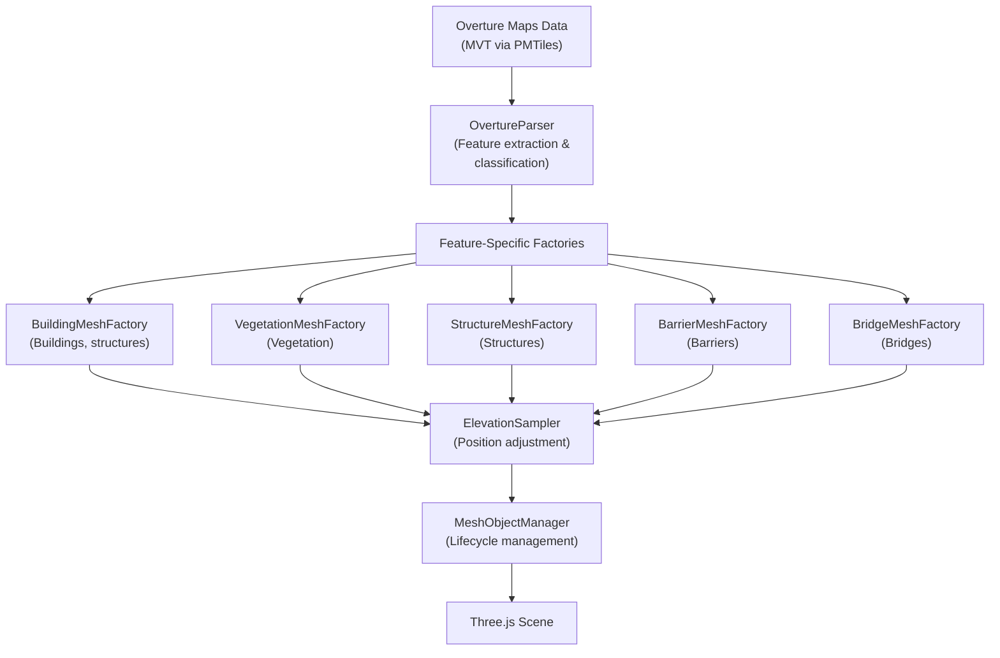
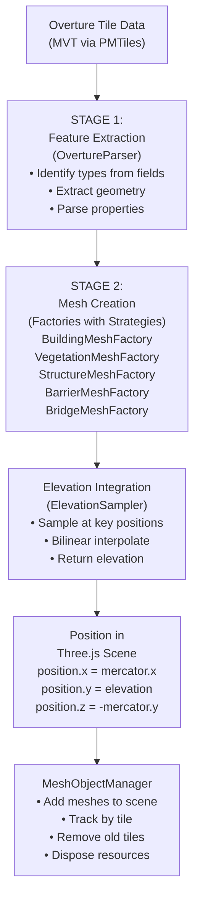

# 3D Object Visualization

## Overview

The simulator visualizes five categories of real-world objects extracted from Overture Maps data. Each type is rendered as 3D geometry in the Three.js scene using specialized mesh factories that transform geographic data into spatial meshes.

**Object Categories:**

1. **Buildings**: Extrusion-based 3D structures with parametric roofs (gabled, hipped, domed, etc.)
2. **Vegetation**: Distributed trees, forests, shrubs, orchards, and vineyards using instanced mesh for efficiency
3. **Structures**: Man-made objects like towers, chimneys, water towers, and cranes built from parametric shapes
4. **Barriers**: Linear features like walls, hedges, and fences extruded along their paths
5. **Bridges**: Elevated deck segments for roads and railways with layer-based height control

**Data Pipeline:**

The 3D objects system follows the standard **Data Pipeline Pattern**
(see [`doc/data-pipeline.md`](../data-pipeline.md) for detailed explanation).



---

## Buildings

### Visual Characteristics

Buildings appear as 3D extruded structures with vertical walls and roofs. They range from simple flat-top boxes to complex pitched-roof shapes with varied ridges and orientations. Walls and roofs have distinct colors based on material properties.

**Examples:**
- Residential house: beige walls (#d4c8b8) with pitched roof (#906050)
- Modern commercial: gray walls (#c8c0b8) with flat roof (#a0a090)
- Church: stone walls (#b8b0a0) with dark slate roof (#708090)

### Data Sources

Buildings are identified by Overture fields:
- `building=*` (type: house, residential, commercial, office, etc.)
- `height` or `building:levels` (determines wall height)
- `roof:shape` (flat, gabled, hipped, pyramidal, dome, onion, cone, etc.)
- `roof:direction` or `roof:orientation` (angles for pitched roofs)
- `roof:height` (proportion of roof above walls, defaults to 30% of building width)
- `building:min_level` (height offset for buildings on slopes)
- `building:material` (brick, concrete, glass, stone, wood, etc.) — overrides type-based color
- `roof:material` (tiles, slate, metal, copper, grass, thatch, etc.) — overrides default roof color
- `roof:colour` (explicit RGB override)

### Rendering Strategy

1. **Geometry Creation**: Three.js `ExtrudeGeometry` extrudes a 2D polygon outline vertically to create walls
   - Outer ring defines building footprint
   - Inner rings define courtyard holes (cutouts)
2. **Local Coordinate Space**: Geometry built relative to polygon centroid to preserve precision at large Mercator coordinates
3. **Wall Height**: Resolved from height tag, levels × 3m, or type-specific defaults
4. **Roof Handling**:
   - **Flat roofs**: Top cap of wall extrusion uses roof color
   - **Pitched roofs**: Separate `RoofGeometryFactory` generates ridge geometry based on shape and orientation; meshes grouped together

### Geometry Details

**Flat-Roof Building:**
- Single `Mesh` with `ExtrudeGeometry`
- 3 material groups: walls (sides), ceiling (top cap), base (bottom)
- Positioned at terrain elevation + min_height

**Pitched-Roof Building:**
- `Group` containing 2 meshes:
  1. **Wall mesh**: `ExtrudeGeometry` with wall color
  2. **Roof mesh**: Parametric shape (gabled polygon, cone, hemisphere, etc.) with roof color
- Roof mesh positioned above walls at height `wallHeight`

**Material Colors:**
- Wall: `building:material` override → `building` type default → fallback #d0ccbc
- Roof: `roof:colour` override → `roof:material` override → roof shape default

### Configuration

| Parameter | Value | Source |
|-----------|-------|--------|
| Default wall height (fallback) | 6m | `buildingHeightDefaults['other']` |
| Residential house height | 6m | config.ts |
| Apartment height | 12m per default; 3m per level | config.ts |
| Cathedral height | 20m | config.ts |
| Default roof height | 30% of minor OBB axis, clamped [1–8m] | BuildingMeshFactory.defaultRoofHeight() |
| Flat roof color | #a0a090 | roofColorDefaults.flat |
| Pitched roof color | #906050 | roofColorDefaults.pitched |
| Wall color (residential) | #d4c8b8 | colorPalette.buildings.residential |

### Elevation Handling

- **Terrain sampling**: Elevation sampled at polygon centroid via `ElevationSampler.sampleAt()`
- **Base positioning**: World Y = sampled elevation + min_height
- **Slope alignment**: Buildings rest on terrain surface; roofs remain level (no tilting)
- **Precision**: Local coordinate geometry prevents float32 precision loss when building is far from origin

---

## Vegetation

### Visual Characteristics

Vegetation appears as distributed trees, forests, shrubs, and cultivated areas. Trees have visible trunks (cylinders) and canopies (spheres for broadleaf, cones for needleleaf). Scrub and shrubs are compact bushes. Large forests appear as dense point clouds at distance.

**Examples:**
- Forest: hundreds of tall trees with dark green canopies (#3a7a30)
- Orchard: grid of evenly-spaced fruit trees
- Vineyard: dense, low vegetation with small canopies
- Scrub: scattered bushes without visible trunks (#5a8a40)

### Data Sources

Vegetation areas identified by Overture fields:
- `natural=forest`, `wood`, `scrub`, `heath`, `grassland`
- `landuse=forest`, `wood`, `vineyard`, `orchard`
- `leaf_type=deciduous` or `needleleaved` (determines canopy shape)
- Single trees: `natural=tree` (Point geometry)
- Tree rows: `natural=tree_row` (LineString geometry)

### Rendering Strategy

**Strategy Pattern**: Each vegetation type (forest, scrub, orchard, vineyard, single tree, tree row) uses a dedicated strategy class implementing consistent tree/bush creation.

**Key Optimization: InstancedMesh**

Instead of creating individual meshes for 100s or 1000s of trees, the system uses Three.js `InstancedMesh`:
- Single geometry (e.g., cylinder for trunk) drawn multiple times with different transforms
- **Memory efficiency**: O(1) geometry, O(n) per-instance transforms (matrices)
- **GPU efficiency**: Single draw call per type instead of n draw calls
- **Color variation**: Per-instance color attributes add visual variety

**Distribution Methods:**

1. **Forest/Scrub**: Distribute points randomly within polygon using seeded hash function
   - Density configured as trees per 100m² (`densityPer100m2`)
   - Jitter applied to grid to avoid grid artifact
2. **Orchard/Vineyard**: Regular grid spacing with optional jitter
   - `spacingX` × `spacingY` meters between plants
3. **Single Tree**: Point geometry → single tree mesh at location
4. **Tree Row**: LineString interpolated at regular intervals along path

### Geometry Details

**Tree Structure (Forest/Scrub):**
- **Trunk**: Tapered cylinder (base 0.2m radius, top 0.15m radius, height 40% of tree)
- **Canopy**:
  - Broadleaf: Sphere scaled to crown radius
  - Needleleaf: Cone scaled to height and radius
- **Coloring**: Each tree instance assigned random color from palette (#3a7a30 to #407a30 for broadleaf)
- **Elevation**: Sampled at tree point; trunk base at terrain elevation

**Bush Structure (Scrub):**
- Single sphere (no trunk), height × 0.6 × radius aspect ratio
- Color varied from palette (#4a7a38 to #5a8a40)

**Instancing Implementation:**
```
count = number of trees
For each tree i:
  - Sample terrain elevation at tree location
  - Create transform matrix (scale + position)
  - Set matrix at index i in InstancedMesh
  - Set per-instance color at index i
Update InstancedMesh.instanceMatrix.needsUpdate = true
```

### Configuration

| Parameter | Forest | Scrub | Orchard | Vineyard | Tree Row |
|-----------|--------|-------|---------|----------|----------|
| **Density** | 1.0 trees/100m² | 4.0 trees/100m² | — | — | — |
| **Spacing X** | calculated | calculated | 5m | 2m | 8m interval |
| **Spacing Y** | calculated | calculated | 4m | 1m | along path |
| **Trunk height min** | 8m | 0m | 3m | 0m | 6m |
| **Trunk height max** | 15m | 0m | 6m | 0m | 12m |
| **Crown radius min** | 2m | 1m | 1.5m | 0.4m | 1.5m |
| **Crown radius max** | 5m | 2.5m | 2.5m | 0.8m | 3m |
| **Max points per area** | 2000 | 2000 | 2000 | 2000 | — |
| **Trunk color** | #6b4226 | #6b4226 | #6b4226 | #6b4226 | #6b4226 |
| **Canopy colors** | See below | #4a7a38–#5a8a40 | #2d6b1e–#408030 | #2d6b1e–#408030 | #2d6b1e–#408030 |

**Color Palettes:**
- Broadleaf: #2d6b1e, #3a7a30, #357a28, #408030
- Needleleaf: #1a5020, #205828, #256030, #1a4a20

### Elevation Handling

- **Per-tree sampling**: `ElevationSampler.sampleAt()` called for each tree instance during mesh creation
- **Terrain-aware positioning**: Trunk base positioned at sampled elevation
- **Precision**: Matrix transforms include full position (x, terrainY, -y)
- **Density adaptation**: If estimated point count exceeds 2000, spacing automatically increased to maintain performance

---

## Structures

### Visual Characteristics

Structures appear as distinctive man-made objects: towers rise as cylinders or tapered pillars, water towers have bulbous tanks, cranes have angular frames. Each structure type has a characteristic shape and color.

**Examples:**
- Cellular tower: gray cylinder 20m tall (#a0a098)
- Chimney: tapered cylinder 40m tall, darker gray (#888880)
- Water tower: cylinder with spherical tank on top (#a8a8b0)
- Crane: complex frame geometry in yellow (#f0b800)

### Data Sources

Structures identified by Overture fields:
- `man_made=tower`, `chimney`, `mast`, `water_tower`, `silo`, `storage_tank`, `lighthouse`, `crane`
- `power=tower`, `pole`, `generator` (with subtypes)
- `aerialway=pylon`
- `height` tag (in meters)
- `diameter` tag (converted to radius)
- `colour` tag (explicit color override)

### Rendering Strategy

**Strategy Pattern**: Each structure type implements `IStructureStrategy` with a `create()` method that generates geometry from parametric inputs (radius, height, color).

**Shapes:**
- **Cylinder**: Straight-sided pillars (towers, silos, poles, storage tanks)
- **Tapered Cylinder**: Narrower at top (chimneys, masts, lighthouses)
- **Box**: Angular frames (power towers, pylon structures)
- **Water Tower**: Cylinder base with sphere cap
- **Crane**: Complex multi-part frame with jib and counterweight

### Geometry Details

**Cylinder (Tower, Silo):**
- `CylinderGeometry(radius, radius, height, 8)` — 8-sided for efficiency
- Position: X/Z at structure centroid, Y at terrain elevation + height/2 (center of object)

**Tapered Cylinder (Chimney, Mast):**
- `CylinderGeometry(radiusTop, radiusBottom, height, 8)` — top narrower than bottom
- Gradual taper creates realistic taper effect

**Box (Power Tower):**
- `BoxGeometry(width, height, depth)` — cubic or rectangular
- Stiff angular appearance suitable for lattice structures

**Water Tower:**
- Composite: cylinder base + sphere tank cap
- Sphere scaled and positioned above cylinder

**Crane:**
- Multi-geometry assembly: vertical mast, horizontal jib, counterweight, hook
- Rotated by structure `rotation_angle` if present

All structures use Lambert material with spec colors for realistic outdoor lighting.

### Configuration

| Structure Type | Shape | Default Height | Default Radius | Color |
|---|---|---|---|---|
| tower | cylinder | 20m | 3m | #a0a098 |
| communications_tower | cylinder | 50m | 4m | #a0a098 |
| chimney | tapered_cylinder | 40m | 2m | #888880 |
| mast | tapered_cylinder | 30m | 1m | #b0b0b0 |
| silo | cylinder | 15m | 4m | #d0c8b0 |
| storage_tank | cylinder | 10m | 8m | #c0c0c0 |
| water_tower | water_tower | 20m | 5m | #a8a8b0 |
| lighthouse | tapered_cylinder | 25m | 3m | #f0f0e8 |
| crane | crane | 40m | 1m | #f0b800 |
| power_tower | box | 25m | 1.5m | #c0c0c8 |
| power_pole | cylinder | 10m | 0.2m | #a08060 |
| aerialway_pylon | box | 12m | 1m | #b0b0b8 |

### Elevation Handling

- **Position selection**: Point geometries use coordinates directly; polygon geometries use centroid
- **Terrain sampling**: `ElevationSampler.sampleAt()` called at structure position
- **Vertical positioning**: Structure centered at terrain elevation + height/2 (so base touches ground)
- **No rotation**: Structures remain level regardless of terrain slope

---

## Barriers

### Visual Characteristics

Barriers appear as linear features running across the landscape. Walls are thin, tall, and rigid. Hedges are wider, lower, and green. Retaining walls are squat and sturdy. City walls are massive stone structures.

**Examples:**
- Garden wall: 0.3m wide, 2m tall, beige (#c0b8b0)
- Hedge: 1m wide, 1.5m tall, dark green (#4a7030)
- City wall: 2m wide, 6m tall, stone (#c8c0b0)
- Retaining wall: 0.5m wide, 1.5m tall, gray (#a8a098)

### Data Sources

Barriers identified by Overture fields:
- `barrier=wall`, `city_wall`, `retaining_wall`, `fence`, `hedge`, `guardrail`
- `height` tag (in meters)
- `width` tag (in meters, defaults based on type)
- `material` tag (brick, concrete, stone, wood, metal) — overrides type color
- `colour` tag (explicit RGB override)

### Rendering Strategy

**Line Extrusion**: Each LineString segment is converted to a box mesh:

1. For each consecutive pair of coordinates in the LineString:
   - Compute segment midpoint and length
   - Calculate rotation angle to align with path
   - Create `BoxGeometry(width, height, segmentLength)`
   - Position at midpoint with appropriate rotation
   - Sample elevation at midpoint

2. **Rotation**: `rotation.y = -angle` where `angle = atan2(dx, dy)` aligns box along path

### Geometry Details

**Box Mesh per Segment:**
- Dimensions: (width, height, length)
  - Width: configured per type or tag (0.3m wall, 1m hedge)
  - Height: configured per type or tag (2m wall, 1.5m hedge)
  - Length: segment length in Mercator coordinates
- Material: `MeshLambertMaterial` with type or material-based color
- Positioning: Centered at segment midpoint, terrain elevation + height/2

**Example (Garden Wall, 50m segment):**
```
BoxGeometry(0.3, 2.0, 50)           // 0.3m thick, 2m tall, 50m long
Position: (midX, terrainY + 1.0, -midY)
Rotation.y: -angleToAlignWithPath
Color: #c0b8b0
```

### Configuration

| Barrier Type | Default Width | Default Height | Default Color |
|---|---|---|---|
| wall | 0.3m | 2.0m | #c0b8b0 |
| city_wall | 2.0m | 6.0m | #c8c0b0 |
| retaining_wall | 0.5m | 1.5m | #a8a098 |
| hedge | 1.0m | 1.5m | #4a7030 |

**Material Color Overrides:**
Same palette as buildings: brick (#c87060), concrete (#c8c4b8), stone (#b8b0a0), wood (#c8a878), metal (#888888), etc.

### Elevation Handling

- **Midpoint sampling**: Elevation sampled at segment midpoint
- **Vertical positioning**: Height/2 above terrain, so base touches ground
- **Slope following**: Each segment independently samples elevation, creating stepped appearance on steep terrain
- **Precision**: Segments reconnect seamlessly across segment boundaries

---

## Bridges

### Visual Characteristics

Bridges appear as elevated flat decks spanning roads and railways. They float above terrain, supported by layer height (vertical separation). Decks are proportionally wider than the underlying road/rail to show structural overhang.

**Examples:**
- Highway overpass: wide gray deck (#b0a898) elevated 1 layer (5m) above road
- Railway bridge: thinner deck elevated 2 layers (10m) above terrain
- Pedestrian bridge: narrow deck at 1 layer height

### Data Sources

Bridges identified by Overture fields:
- `bridge=yes` on `highway=*` or `railway=*` features
- `layer=N` (integer, default 1) — vertical separation in multiples of 5m per layer
- `width` tag for road width, default rail width from `railway=*` type
- Deck margin: automatically adds 2m on each side of road/rail width

### Rendering Strategy

**Deck Extrusion**: Similar to barriers but simpler — just a flat box at elevated height:

1. For each consecutive pair of coordinates in LineString:
   - Compute midpoint and length
   - Calculate rotation angle
   - Create flat `BoxGeometry(deckWidth, DECK_THICKNESS, segmentLength)` where:
     - deckWidth = road/rail width + 4m (2m margin per side)
     - DECK_THICKNESS = 0.5m
   - Position at terrain elevation + layer × 5m

### Geometry Details

**Deck Mesh per Segment:**
- Dimensions: (width, 0.5m thickness, length)
- Width = vehicle width + 4m (represents deck overhang)
  - Motorway (25m): deck 29m
  - Railway (4m): deck 8m
  - Footway (2m): deck 6m
- Material: Tan/beige Lambert (#b0a898)
- Positioning: Centered at midpoint, terrain elevation + layer height offset

**Layer Height Calculation:**
```
verticalOffset = layer × 5m
Examples:
  layer=1: 5m above terrain
  layer=2: 10m above terrain
  layer=-1: 5m below terrain (underpass)
```

### Configuration

| Parameter | Value |
|---|---|
| Deck color | #b0a898 (tan, resembles concrete) |
| Deck thickness | 0.5m |
| Deck margin | 2m on each side (total +4m to road width) |
| Layer height multiplier | 5m per layer unit |
| Default layer | 1 (if not specified) |

### Elevation Handling

- **Base elevation**: Sampled at segment midpoint (same as road/rail below)
- **Vertical offset**: Added to base elevation based on layer tag
- **No tilt**: Deck remains horizontal even on slopes (realistic for bridge engineering)
- **Precision**: Each segment samples independently

---

## Rendering Pipeline

### Data Flow



### Stage 1: Data Parsing

- **Input**: MVT tile data from Overture Maps PMTiles
- **Process**: OvertureParser identifies each feature's type using Overture fields (e.g., `class`, `subtype`)
- **Output**: Typed feature objects (`BuildingVisual`, `VegetationVisual`, `StructureVisual`, etc.) with extracted properties

### Stage 2: Mesh Creation

- **Input**: Array of typed features
- **Process**: Appropriate factory class (`BuildingMeshFactory`, `VegetationMeshFactory`, etc.) creates Three.js geometry
  - Applies elevation sampling at key points
  - Builds local coordinate geometries for precision
  - Applies colors, materials, textures
  - Uses strategy patterns for variant shapes (e.g., roof types, vegetation strategies)
- **Output**: Array of Three.js `Object3D` (Mesh, Group, or InstancedMesh)

### Stage 3: Scene Management

- **Input**: Meshes from Stage 2
- **Process**: `MeshObjectManager` coordinates mesh lifecycle
  - Adds meshes to Three.js scene at current position
  - Tracks meshes by tile key (z:x:y)
  - When tile ring updates, removes meshes for old tiles
  - Disposes geometries and materials
  - Subscribes to `ElevationDataManager.tileAdded` (via `TileObjectManager` secondary sources): if an elevation tile arrives *after* the matching context tile, all meshes for that tile are disposed and recreated so they sample the correct terrain elevation
- **Output**: Animated scene with meshes added/removed as drone moves

### Performance Implications

| Stage | Performance Bottleneck | Optimization |
|---|---|---|
| **Data Parsing** | Large GeoJSON parsing | Streamed tile loading, parser runs on background |
| **Mesh Creation** | Geometry generation is CPU-bound | Factories run synchronously; caching geometry templates |
| **Elevation Sampling** | Bilinear interpolation × thousands of points | Cached in Stage 2, not re-sampled during rendering |
| **Scene Management** | Add/remove meshes, material disposal | Batched per tile; disposal deferred to next animation frame |

---

## Spatial Organization

### Tile-Based Ring System

Objects are organized by tile and loaded in a ring around the drone:

- **Tile Grid**: Web Mercator zoom 15 divides world into 2^15 × 2^15 tiles (~327 m × ~327 m each at equator)
- **Tile Key**: `"z:x:y"` uniquely identifies a tile (e.g., `"15:16807:11239"`)
- **Ring Radius**: Config parameter `contextDataConfig.ringRadius = 1` loads a 3×3 grid (center ±1 tile in each direction)

For detailed tile ring visualization and fetch order patterns, see
[Tile Ring System](../tile-ring-system.md). The numbered fetch order shown there
([2]–[10] pattern) indicates which tiles load first as the drone moves. Understanding
this pattern is key to optimizing object data loading and ensuring seamless mesh
transitions when crossing tile boundaries.

### Mercator to Three.js Coordinate Transformation

Objects use the standard **Mercator-to-Three.js transformation**:

```
x = mercator.x       (East = +X)
y = elevation_m      (Up = +Y)
z = -mercator.y      (North = -Z, negated)
```

The Z negation aligns Mercator (Y increasing northward) with Three.js camera (looking along -Z). See [Coordinate System & Rendering Strategy](../coordinate-system.md) for full explanation.

Verification: All drone/camera/object positioning uses this formula consistently.

### Elevation Sampling & Bilinear Interpolation

For a complete explanation of the bilinear interpolation algorithm, API documentation, precision details, and edge case handling, see **[Elevation Sampling & Interpolation](../data/elevation-sampler.md)**.

**Briefly:** Each mesh factory calls `elevationSampler.sampleAt(lat, lng)` to determine terrain height at an object's location. The sampler uses bilinear interpolation to blend values from 4 neighboring elevation pixels, producing smooth terrain without visible pixelation.

The algorithm accounts for critical details:
- **Mercator Y inversion** (row 0 = north edge, increases southward)
- **Sub-pixel fractional offsets** (tx, ty) to blend between pixels
- **Boundary clamping** (prevents out-of-bounds access at tile edges)
- **Unloaded tiles** (returns 0 for missing data, geometry fills with default elevation)

### Why Objects Align Correctly

All feature meshes are positioned using `geoToLocal(lat, lng, elevation, tileCenter)` relative to their tile's geographic center. The tile group is then positioned at `geoToLocal(tileCenter, droneOrigin)`. This two-level placement keeps all objects spatially consistent:

1. **Buildings** — `geoToLocal(centroidLat, centroidLng, terrainY, tileCenter)` (BuildingMeshFactory)
2. **Vegetation** — `geoToLocal(treeLat, treeLng, terrainY + offset, tileCenter)` (vegetation strategies)
3. **Structures** — `geoToLocal(lat, lng, terrainY + offset, tileCenter)` (StructureMeshFactory)
4. **Barriers** — `geoToLocal(segmentMidLat, segmentMidLng, terrainY + offset, tileCenter)` (BarrierMeshFactory)
5. **Bridges** — `geoToLocal(segmentMidLat, segmentMidLng, terrainY + offset, tileCenter)` (BridgeMeshFactory)

All use the same `geoToLocal()` formula with the tile center as origin, ensuring spatial alignment within each tile group.

---

## Performance & Optimization

### Instanced Mesh for Vegetation

**Problem**: A forest with 1,000 trees as individual meshes = 2,000 draw calls (trunk + canopy), significant GPU overhead.

**Solution**: `InstancedMesh`
- Single trunk geometry drawn 1,000 times with different transform matrices
- Single canopy geometry drawn 1,000 times with different matrices + per-instance colors
- **Result**: 2 draw calls regardless of tree count

**Implementation**:
```
Create trunk/canopy geometries once
Create InstancedMesh(geometry, material, 1000)
For each tree i:
  setMatrixAt(i, transformMatrix)      // scale + position
  setColorAt(i, colorValue)             // per-instance color
Update instanceMatrix.needsUpdate = true
```

**GPU Memory Impact:**
- Geometry: ~10KB (shared)
- Per-instance data: ~64 bytes × count (transform matrix only)
- 1,000 trees: ~64KB instance data vs. ~10MB for individual meshes

### Local Coordinate Geometry for Buildings

**Problem**: Mercator coordinates at zoom 15 are ~250,000–500,000 units. Float32 has ~7 significant digits; such large coordinates lose precision in geometry vertices.

**Solution**: Build geometry in local coordinates relative to polygon centroid
```
centroid = (261700, 6250000)  // Building in Paris
localVertex = (vertex - centroid)       // Relative coordinates
Create geometry in local space [−1000, +1000] range
Position mesh at world centroid
```

**Result**: Geometry vertices maintain sub-meter precision despite large Mercator offset.

### Material Sharing Strategies

- **Buildings**: All walls share `MeshLambertMaterial` instances per color (palette of ~20 colors)
- **Vegetation**: Single trunk material + single canopy material per color variation
- **Barriers**: Single material per barrier type

**GPU Memory**: Reusing materials reduces material object count by 90%+ compared to unique materials per mesh.

### Tile-Based Culling

- **Ring System**: Only 9 tiles loaded at a time (3×3 grid)
- **Result**: Max ~500–2,000 visible objects at any time
- **Comparison**: Without culling, entire world would be loaded (impossible for large datasets)

---

## Key Parameters & Configuration

Configuration values are centralized in `src/config.ts`. Key visualization parameters:

### Building Configuration

| Parameter | Value | Effect |
|---|---|---|
| `buildingHeightDefaults['residential']` | 6m | Default house height if not tagged |
| `buildingHeightDefaults['apartments']` | 12m | Multi-story buildings |
| `roofColorDefaults.pitched` | #906050 (brown) | Pitched roofs (gabled, hipped, etc.) |
| `roofColorDefaults.flat` | #a0a090 (gray) | Flat roofs |

### Vegetation Configuration

| Parameter | Forest | Scrub | Orchard |
|---|---|---|---|
| `vegetationMeshConfig.forest.densityPer100m2` | 1.0 | 4.0 | — |
| `vegetationMeshConfig.forest.trunkHeightMin` | 8m | 0m | 3m |
| `vegetationMeshConfig.forest.crownRadiusMax` | 5m | 2.5m | 2.5m |

**Tuning Density for Performance:**
- Forest 1.0 trees/100 m² = ~40 trees per 200 m × 200 m tile at zoom 15
- Can increase to 2.0 for denser forests; decrease to 0.5 for sparser
- Max 2,000 points per polygon prevents memory explosion

### Structure Configuration

| Structure Type | Default Height | Default Radius |
|---|---|---|
| `structureDefaults.tower` | 20m | 3m |
| `structureDefaults.chimney` | 40m | 2m |
| `structureDefaults.communications_tower` | 50m | 4m |
| `structureDefaults.crane` | 40m | 1m |

### Barrier Configuration

| Parameter | Wall | City Wall | Hedge |
|---|---|---|---|
| Default width | 0.3m | 2.0m | 1.0m |
| Default height | 2.0m | 6.0m | 1.5m |
| Default color | #c0b8b0 | #c8c0b0 | #4a7030 |

### Bridge Configuration

| Parameter | Value |
|---|---|
| Deck color | #b0a898 |
| Deck thickness | 0.5m |
| Layer height multiplier | 5m per layer |
| Deck margin | 2m per side (4m total overhang) |

### Adjusting Visual Appearance

**Example: Make trees taller**
```typescript
// In src/config.ts
vegetationMeshConfig.forest.trunkHeightMax = 20  // was 15m
```

**Example: Make buildings higher**
```typescript
buildingHeightDefaults['residential'] = 8  // was 6 m
```

**Example: Change barrier color**
```typescript
barrierDefaults.wall.color = '#a0a0a0'  // was #c0b8b0
```

Changes apply to all newly-loaded tiles; existing tiles retain old values until re-rendered.

---

## See Also

- **[Glossary](../glossary.md)** - Definitions of all technical terms

## Related Documentation

- **`doc/coordinate-system.md`**: Full coordinate system specification with detailed math
- **`doc/data/elevations.md`**: Elevation data source, Terrarium format, sampling details
- **`doc/architecture.md`**: System-wide architecture and component relationships
- **`src/config.ts`**: Configuration values for all appearance parameters
- **`src/visualization/mesh/`**: Factory implementations (source code)
- **`src/visualization/MeshObjectManager.ts`**: Lifecycle coordination (source code)
