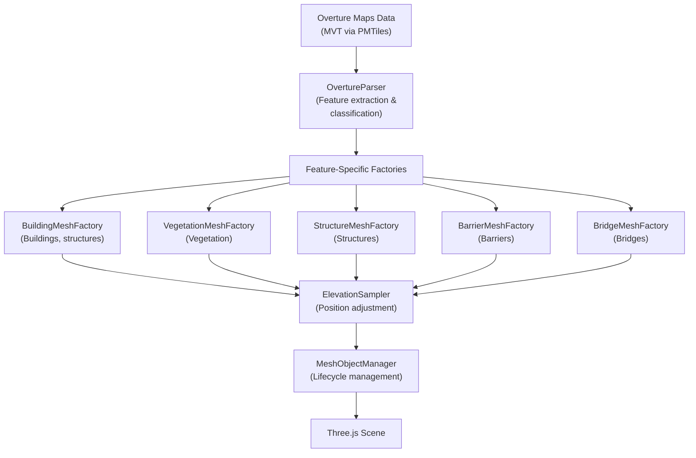
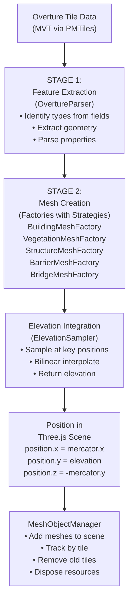

# Systems & Architecture

## Overview

The 3D objects system follows the standard **Data Pipeline Pattern**
(see [`doc/data-pipeline.md`](../../data-pipeline.md) for detailed explanation).



---

## Rendering Pipeline

### Data Flow



### Stage 1: Data Parsing

- **Input**: MVT tile data from Overture Maps PMTiles
- **Process**: OvertureParser identifies each feature's type using Overture fields (e.g., `class`, `subtype`)
- **Output**: Typed feature objects (`BuildingVisual`, `VegetationVisual`, `StructureVisual`, etc.) with extracted properties

### Stage 2: Mesh Creation

- **Input**: Array of typed features
- **Process**: Appropriate factory class (`BuildingMeshFactory`, `VegetationMeshFactory`, etc.) creates Three.js geometry
  - Applies elevation sampling at key points
  - Builds local coordinate geometries for precision
  - Applies colors, materials, textures
  - Uses strategy patterns for variant shapes (e.g., roof types, vegetation strategies)
- **Output**: Array of Three.js `Object3D` (Mesh, Group, or InstancedMesh)

### Stage 3: Scene Management

- **Input**: Meshes from Stage 2
- **Process**: `MeshObjectManager` coordinates mesh lifecycle
  - Adds meshes to Three.js scene at current position
  - Tracks meshes by tile key (z:x:y)
  - When tile ring updates, removes meshes for old tiles
  - Disposes geometries and materials
  - Subscribes to both `ContextDataManager.tileAdded` and `ElevationDataManager.tileAdded`. Meshes are created only when both are available for a tile. Tiles awaiting elevation are held in a pending map — no rebuild or destroy+recreate cycle occurs.
- **Output**: Animated scene with meshes added/removed as drone moves

### Performance Implications

| Stage | Performance Bottleneck | Optimization |
|---|---|---|
| **Data Parsing** | Large GeoJSON parsing | Streamed tile loading, parser runs on background |
| **Mesh Creation** | Geometry generation is CPU-bound | Factories run synchronously; caching geometry templates |
| **Elevation Sampling** | Bilinear interpolation × thousands of points | Cached in Stage 2, not re-sampled during rendering |
| **Scene Management** | Add/remove meshes, material disposal | Batched per tile; disposal deferred to next animation frame |

---

## Spatial Organization

### Tile-Based Ring System

Objects are organized by tile and loaded in a ring around the drone:

- **Tile Grid**: Web Mercator zoom 15 divides world into 2^15 × 2^15 tiles (~327 m × ~327 m each at equator)
- **Tile Key**: `"z:x:y"` uniquely identifies a tile (e.g., `"15:16807:11239"`)
- **Ring Radius**: Config parameter `contextDataConfig.ringRadius = 1` loads a 3×3 grid (center ±1 tile in each direction)

For detailed tile ring visualization and fetch order patterns, see
[Tile Ring System](../../tile-ring-system.md). The numbered fetch order shown there
([2]–[10] pattern) indicates which tiles load first as the drone moves. Understanding
this pattern is key to optimizing object data loading and ensuring seamless mesh
transitions when crossing tile boundaries.

### Mercator to Three.js Coordinate Transformation

Objects use the standard **Mercator-to-Three.js transformation**:

```
x = mercator.x       (East = +X)
y = elevation_m      (Up = +Y)
z = -mercator.y      (North = -Z, negated)
```

The Z negation aligns Mercator (Y increasing northward) with Three.js camera (looking along -Z). See [Coordinate System & Rendering Strategy](../coordinate-system.md) for full explanation.

Verification: All drone/camera/object positioning uses this formula consistently.

### Elevation Sampling & Bilinear Interpolation

For a complete explanation of the bilinear interpolation algorithm, API documentation, precision details, and edge case handling, see **[Elevation Sampling & Interpolation](../data/elevation-sampler.md)**.

**Briefly:** Each mesh factory calls `elevationSampler.sampleAt(lat, lng)` to determine terrain height at an object's location. The sampler uses bilinear interpolation to blend values from 4 neighboring elevation pixels, producing smooth terrain without visible pixelation.

The algorithm accounts for critical details:
- **Mercator Y inversion** (row 0 = north edge, increases southward)
- **Sub-pixel fractional offsets** (tx, ty) to blend between pixels
- **Boundary clamping** (prevents out-of-bounds access at tile edges)
- **Unloaded tiles** (returns 0 for missing data, geometry fills with default elevation)

### Why Objects Align Correctly

All feature meshes are positioned using `geoToLocal(lat, lng, elevation, tileCenter)` relative to their tile's geographic center. The tile group is then positioned at `geoToLocal(tileCenter, droneOrigin)`. This two-level placement keeps all objects spatially consistent:

1. **Buildings** — `geoToLocal(centroidLat, centroidLng, terrainY, tileCenter)` (BuildingMeshFactory)
2. **Vegetation** — `geoToLocal(treeLat, treeLng, terrainY + offset, tileCenter)` (vegetation strategies)
3. **Structures** — `geoToLocal(lat, lng, terrainY + offset, tileCenter)` (StructureMeshFactory)
4. **Barriers** — `geoToLocal(segmentMidLat, segmentMidLng, terrainY + offset, tileCenter)` (BarrierMeshFactory)
5. **Bridges** — `geoToLocal(segmentMidLat, segmentMidLng, terrainY + offset, tileCenter)` (BridgeMeshFactory)

All use the same `geoToLocal()` formula with the tile center as origin, ensuring spatial alignment within each tile group.

---

## Performance & Optimization

### Local Coordinate Geometry for Buildings

**Problem**: Mercator coordinates at zoom 15 are ~250,000–500,000 units. Float32 has ~7 significant digits; such large coordinates lose precision in geometry vertices.

**Solution**: Build geometry in local coordinates relative to polygon centroid
```
centroid = (261700, 6250000)  // Building in Paris
localVertex = (vertex - centroid)       // Relative coordinates
Create geometry in local space [−1000, +1000] range
Position mesh at world centroid
```

**Result**: Geometry vertices maintain sub-meter precision despite large Mercator offset.

### Material Sharing Strategies

- **Buildings**: All walls share `MeshLambertMaterial` instances per color (palette of ~20 colors)
- **Vegetation**: Single trunk material + single canopy material per color variation
- **Barriers**: Single material per barrier type

**GPU Memory**: Reusing materials reduces material object count by 90%+ compared to unique materials per mesh.

### Tile-Based Culling

- **Ring System**: Only 9 tiles loaded at a time (3×3 grid)
- **Result**: Max ~500–2,000 visible objects at any time
- **Comparison**: Without culling, entire world would be loaded (impossible for large datasets)

---

## See Also

- **[Buildings](buildings.md)** — Building geometry and roofs
- **[Vegetation](vegetation.md)** — Trees and forests
- **[Structures](structures.md)** — Towers and cranes
- **[Barriers](barriers.md)** — Walls and hedges
- **[Bridges](bridges.md)** — Elevated decks
- **[Data Pipeline](../../data-pipeline.md)** — Feature extraction and processing
- **[Elevation Sampling & Interpolation](../data/elevation-sampler.md)** — Terrain height queries
- **[Coordinate System & Rendering](../coordinate-system.md)** — Geographic to 3D transformation
- **[Tile Ring System](../../tile-ring-system.md)** — Tile loading and management
- **[Glossary](../glossary.md)** — Technical terminology
